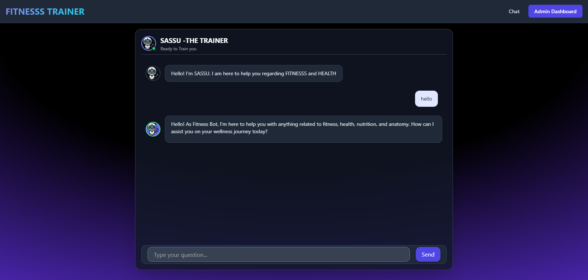

# 🏋️‍♂️ Fitness Bot AI - Enterprise-Grade RAG Fitness Assistant


Fitness Bot is a production-ready, full-stack AI application designed to provide specialized fitness and health coaching. Unlike generic LLMs, Fitness Bot leverages a **Retrieval-Augmented Generation (RAG)** engine to ingest, index, and retrieve specific domain knowledge (PDFs/Text) uploaded by administrators.

This project demonstrates a modular architecture capable of running complex AI workflows on constrained cloud environments (Free Tier optimizations).

---

## 🚀 Live Demo
### [🔗 Click Here to Launch App](https://ai-chatbot-integrated-with-admin.onrender.com)
*(Note: Deployed on **Render** Free Tier. Please allow up to 50 seconds for the server to wake up on the first request.)*

---

## 📸 Interface Preview

 **Intelligent Chat Interface** 
  
 ### Features: Markdown rendering, Dynamic Avatars, Glassmorphism UI. 
 **Admin Command Center** 
  
 ### Features: Real-time Analytics, RAG Training, CRUD, Log Management
---

## 🏗️ System Architecture

The application follows a **Service-Oriented Architecture (SOA)** using the Factory Pattern to ensure separation of concerns between Data, AI Logic, and Interface.

### The RAG Pipeline (Retrieval-Augmented Generation)
1.  **Ingestion:** Admin uploads unstructured data (PDFs/Text) via the Dashboard.
2.  **ETL Process:** `PyPDF` extracts raw text, which is cleaned and chunked.
3.  **Vectorization:** Google's `text-embedding-004` model converts chunks into high-dimensional vectors.
4.  **Indexing:** Vectors are stored in **ChromaDB** (Lightweight configuration).
5.  **Retrieval & Synthesis:** User queries trigger a vector search; relevant context is injected into the **Gemini 2.5 Flash** system prompt to generate accurate, hallucination-free responses.

---

## 🛠️ Technology Stack

| Domain | Technology | Justification |
| :--- | :--- | :--- |
| **Backend** | **Flask (Python)** | Lightweight micro-framework allowing granular control over the request lifecycle. |
| **Database** | **SQLAlchemy + SQLite** | robust ORM for relational data (Chat Logs, Sessions). Configured for Linux compatibility (`pysqlite3`). |
| **AI Core** | **Google Gemini 2.5 Flash** | Optimized for high throughput and low latency (50 RPM limits on Free Tier). |
| **Vector Search** | **ChromaDB** | Serverless vector store optimized for local persistent storage. |
| **Frontend** | **Tailwind CSS** | Utility-first CSS framework for rapid, responsive UI development without custom stylesheets. |
| **Infrastructure** | **Gunicorn + Render** | Production-grade WSGI server configured with custom timeouts for heavy AI loads. |

---

## 📂 Project Directory Structure

```text
fitness-ai-bot/
├── app.py                   # Application Entry Point & Route Definitions
├── requirements.txt         # Dependency Manifest (Linux compatible)
├── .gitignore               # Security Rules
├── README.md                # Documentation
│
├── utils/                   # 🧠 Core Logic Modules
│   ├── __init__.py
│   ├── ai_handler.py        # Gemini API Wrapper & Context Injection
│   ├── db_handler.py        # SQLAlchemy ORM Models & CRUD Operations
│   └── rag_engine.py        # ChromaDB Interface & Embedding Logic
│
├── templates/               # 🎨 Jinja2 Templates
│   ├── base.html            # Master Layout (Tailwind CDN)
│   ├── chat.html            # Chat Interface with JavaScript Logic
│   ├── dashboard.html       # Admin Panel & Analytics Charts & logs
│   └── login.html           # Authentication View           
│                
└── screenshots/             # Documentation Images 
```
## ✨ Key Features

- 🔍 Retrieval-Augmented Generation (RAG) for hallucination-resistant responses
- 📄 Admin-managed knowledge ingestion (PDF/Text)
- 🧠 Context-aware fitness coaching using domain-specific embeddings
- 📊 Admin analytics dashboard (usage, logs, training data)
- 🔐 Authentication-protected admin command center
- ⚡ Optimized for Free Tier cloud deployment
  


# 🔧 Installation & Local Setup
### Follow these steps to run the project on your own machine.
* **Prerequisites**

  - Python 3.10 or higher.
  - A Google Cloud API Key (for Gemini).
  
## 1. Clone the Repository

```bash
git clone https://github.com/perimilisunil/AI-chatbot-integrated-with-Admin-Dashboard.git
cd AI-chatbot-integrated-with-Admin-Dashboard
```
## 2. Create Virtual Environment
```bash
# Windows
python -m venv venv
venv\Scripts\activate

# Mac/Linux
python3 -m venv venv
source venv/bin/activate
```
## 3. Install Dependencies
```bash
pip install -r requirements.txt
```
## 4. Configure Environment Variables
### Create a .env file in the root directory and add your keys:

```Ini
GEMINI_API_KEY=your_actual_google_api_key
FLASK_SECRET_KEY=complex_random_string_for_sessions
ADMIN_PASSWORD=set_password
```
## 5. Run the Application
```bash
python app.py
```
  - **User Interface**: http://127.0.0.1:5000
  - **Admin Dashboard**: http://127.0.0.1:5000/admin/login
  
## ☁️ Deployment & Cloud Architecture

This project is engineered to be cloud-agnostic but is currently optimized for **Render.com** (Linux/Containerized environments).

### 🚀 Quick Deploy on Render

1.  **Connect Repository:** Link your GitHub repo to a new **Web Service** on Render.
2.  **Build Command:** `pip install -r requirements.txt`
3.  **Start Command:**
    ```bash
    gunicorn app:app --workers 1 --threads 8 --timeout 120
    ```
4.  **Environment Variables:** Add the following keys in the Render Dashboard:
    *   `GEMINI_API_KEY`: (Your Google AI Key)
    *   `FLASK_SECRET_KEY`: (Any random string)
    *   `ADMIN_PASSWORD`: (Your chosen password)
    *   `PYTHON_VERSION`: `3.10.12` (Recommended)

---

### ⚙️ Production Optimizations

We have implemented specific architectural decisions to ensure stability on Free-Tier Cloud instances (limited to 512MB RAM):

#### 1. Linux SQLite Compatibility Fix
Standard Linux containers (like Render/Heroku) often ship with outdated versions of SQLite that are incompatible with **ChromaDB**.
*   **The Fix:** We injected a runtime override in `app.py` that forces the application to use `pysqlite3-binary`, ensuring modern vector database compatibility without changing the underlying OS.

#### 2. Gunicorn Worker Tuning
*   **Configuration:** `--workers 1 --threads 8`
*   **Reasoning:** Python AI libraries (GenAI, Chroma) are memory-intensive. Running multiple worker processes would exceed the 512MB RAM limit and cause `OOM (Out of Memory)` crashes. We utilize **Threading** instead of **Multiprocessing** to handle concurrent requests efficiently within memory constraints.

#### 3. Lazy Loading RAG Engine
The RAG (Retrieval-Augmented Generation) pipeline is initialized only upon the first request rather than at startup. This prevents "Timeout" errors during the deployment phase and ensures the server boots instantly.

---

### ⚠️ Note on Data Persistence (Free Tier)
Render's free tier utilizes **Ephemeral Storage**.
*   **Chat History:** Persisted safely via **Neon (PostgreSQL)** (if configured) or resets on restart (if using SQLite).
*   **RAG Knowledge Base:** Uploaded PDFs are processed into a local Vector Store. On the free tier, this knowledge resets if the server spins down due to inactivity.
    *   *Production Solution:* For persistent vector storage in production, switch the `rag_engine.py` logic to point to **Pinecone** or **Weaviate** cloud instances.

## 🧪 Testing & Quality Assurance
During development, this project underwent rigorous testing to ensure stability on Cloud environments:
*   **Unit Testing:** Verified API connectivity and database integrity using custom Python scripts before deployment.
*   **Environment Validation:** Automated checks for API key presence and library version compatibility.
*   **Memory Optimization:** Stress-tested the RAG engine to ensure it operates within the 512MB RAM limit of the Render Free Tier.
*   **Strategic NLP Omission**: While the architecture supports Sentiment Analysis (via TextBlob), this module was intentionally removed from the production branch to prioritize server stability and ensure the         application runs smoothly on **RENDER**

